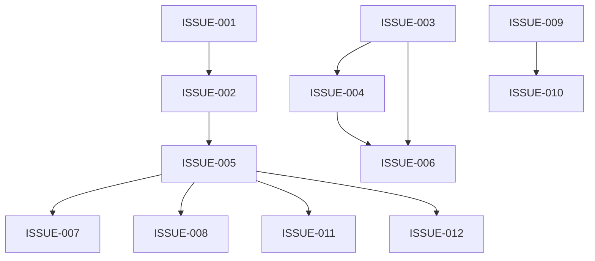

# PVC Engineering Backlog

This document consolidates findings from the existing audit set into a single master issue tracker.

Audit sources used:

- [PVC_AUDIT/01_EXECUTIVE_SUMMARY.md](PVC_AUDIT/01_EXECUTIVE_SUMMARY.md)
- [PVC_AUDIT/02_PROJECT_STRUCTURE.md](PVC_AUDIT/02_PROJECT_STRUCTURE.md)
- [PVC_AUDIT/03_DATABASE_AUDIT.md](PVC_AUDIT/03_DATABASE_AUDIT.md)
- [PVC_AUDIT/04_PAGE_AUDIT.md](PVC_AUDIT/04_PAGE_AUDIT.md)
- [PVC_AUDIT/05_NAVIGATION_AUDIT.md](PVC_AUDIT/05_NAVIGATION_AUDIT.md)
- [PVC_AUDIT/06_SEARCH_AUDIT.md](PVC_AUDIT/06_SEARCH_AUDIT.md)
- [PVC_AUDIT/07_BRAND_AUDIT.md](PVC_AUDIT/07_BRAND_AUDIT.md)
- [PVC_AUDIT/SEARCH_FILTER_AUDIT.md](PVC_AUDIT/SEARCH_FILTER_AUDIT.md)

## Issues by Priority

| Priority | Count |
|----------|------:|
| Critical | 3 |
| High | 3 |
| Medium | 5 |
| Low | 1 |

## Issues by Category

| Category | Count |
|----------|------:|
| Security | 1 |
| Routing | 1 |
| Database | 1 |
| Search | 1 |
| Architecture | 2 |
| Performance | 1 |
| UX | 2 |
| Business Logic | 1 |
| Refactoring | 1 |
| Accessibility | 1 |

## Milestone Breakdown

| Milestone | Issues |
|-----------|--------|
| Critical Stabilization | 3 |
| Search Refactor | 4 |
| Performance | 1 |
| Functional Improvements | 1 |
| Architecture Cleanup | 2 |
| UX Improvements | 1 |

## Dependency Graph

## Recommended Implementation Order

### Phase 1 - Critical Fixes

- ISSUE-001
- ISSUE-002
- ISSUE-003

### Phase 2 - Search

- ISSUE-004
- ISSUE-005
- ISSUE-007
- ISSUE-011

### Phase 3 - Database

- ISSUE-006

### Phase 4 - Performance

Performance work is covered by ISSUE-006 after the database/index work is complete.

### Phase 5 - Refactoring

- ISSUE-009
- ISSUE-010

### Phase 6 - Future Enhancements

- ISSUE-008
- ISSUE-012

## Progress Tracker

| ID | Title | Priority | Status |
|----|-------|----------|--------|
| ISSUE-001 | Admin Authentication Uses Weak Password Handling | Critical | Open |
| ISSUE-002 | Discovery Routes and URL Parameters Are Inconsistent | Critical | Open |
| ISSUE-003 | Catalog Data Is Not Normalized or De-duplicated | Critical | Open |
| ISSUE-004 | Search Uses Weak Matching and Ranking | High | Open |
| ISSUE-005 | Search and Filter State Are Not Unified | High | Open |
| ISSUE-006 | Query Performance Needs Index and Predicate Optimization | High | Open |
| ISSUE-007 | Sidebar Filters Lose UX Context on Refresh and Scroll | Medium | Open |
| ISSUE-008 | Stock Filter Is Present in UI but Not Implemented | Medium | Open |
| ISSUE-009 | Public and Admin Database Access Patterns Are Split | Medium | Open |
| ISSUE-010 | Discovery Pages and JS Contain Duplicate Large-Scale Logic | Medium | Open |
| ISSUE-011 | Autocomplete Lacks Fully Accessible Keyboard and Focus Handling | Medium | Open |
| ISSUE-012 | Discovery UX Has Inconsistent Empty States and Mobile Polish Gaps | Low | Open |

## Issue Register

### ISSUE-001 - Admin Authentication Uses Weak Password Handling

Priority: Critical

Category: Security

Description: The admin login flow is not production-grade. The audit found a weak password comparison pattern against stored credentials, which makes the authentication surface too fragile for a live admin panel.

Evidence: [01_EXECUTIVE_SUMMARY.md](PVC_AUDIT/01_EXECUTIVE_SUMMARY.md), [04_PAGE_AUDIT.md](PVC_AUDIT/04_PAGE_AUDIT.md), [03_DATABASE_AUDIT.md](PVC_AUDIT/03_DATABASE_AUDIT.md)

Root Cause: The admin module was implemented with direct credential comparison rather than a hardened authentication workflow with safe verification, session hardening, and account controls.

Affected Files: [admin/index.php](admin/index.php), [admin/config/db.php](admin/config/db.php)

Business Impact: Admin takeover would expose catalog data, brand assets, and product management. This is a direct security and data integrity risk.

Recommended Solution: Replace weak credential handling with secure password verification, hardened session management, rate limiting, and explicit authentication failure handling.

Dependencies: None.

Estimated Complexity: Medium.

Status: Open.

Related Issues: ISSUE-002, ISSUE-003, ISSUE-009.

Labels: security, authentication, admin

Milestone: Critical Stabilization

### ISSUE-002 - Discovery Routes and URL Parameters Are Inconsistent

Priority: Critical

Category: Routing

Description: The discovery layer uses inconsistent route conventions across the homepage, header, product listing, category listing, and search suggestion flows. Some links use `brand`, some use `cat`, some use `catname`, and some historical paths point to pages that are not part of the current public discovery model.

Evidence: [01_EXECUTIVE_SUMMARY.md](PVC_AUDIT/01_EXECUTIVE_SUMMARY.md), [05_NAVIGATION_AUDIT.md](PVC_AUDIT/05_NAVIGATION_AUDIT.md), [06_SEARCH_AUDIT.md](PVC_AUDIT/06_SEARCH_AUDIT.md), [SEARCH_FILTER_AUDIT.md](PVC_AUDIT/SEARCH_FILTER_AUDIT.md)

Root Cause: Discovery routing grew organically across multiple pages and scripts without a single canonical URL contract or a shared route resolver.

Affected Files: [index.php](index.php), [header.php](header.php), [all-products.php](all-products.php), [all-categories.php](all-categories.php), [search-suggest.php](search-suggest.php), [assets/js/global_header.js](assets/js/global_header.js)

Business Impact: Users can hit dead links, receive confusing fallbacks, or lose their discovery context when moving between search, brand, and category flows.

Recommended Solution: Standardize one URL contract for product discovery and centralize route generation and route parsing into shared helpers.

Dependencies: None.

Estimated Complexity: Large.

Status: Open.

Related Issues: ISSUE-005, ISSUE-010, ISSUE-012.

Labels: routing, navigation, architecture

Milestone: Critical Stabilization

### ISSUE-003 - Catalog Data Is Not Normalized or De-duplicated

Priority: Critical

Category: Database

Description: The live catalog contains duplicate brands, duplicate categories, duplicate products, and inconsistent identifier patterns. This weakens search quality, makes browsing ambiguous, and increases the risk of inconsistent merchandising behavior.

Evidence: [03_DATABASE_AUDIT.md](PVC_AUDIT/03_DATABASE_AUDIT.md), [07_BRAND_AUDIT.md](PVC_AUDIT/07_BRAND_AUDIT.md), [01_EXECUTIVE_SUMMARY.md](PVC_AUDIT/01_EXECUTIVE_SUMMARY.md)

Root Cause: The schema supports basic relationships, but the catalog content and lifecycle rules do not enforce enough uniqueness, cleanup, or canonicalization for merchandising semantics.

Affected Files: database tables `brands`, `category`, `products`; [admin/brands.php](admin/brands.php), [admin/categories.php](admin/categories.php), [admin/products.php](admin/products.php), [all-products.php](all-products.php), [all-categories.php](all-categories.php), [search-suggest.php](search-suggest.php)

Business Impact: Duplicate or ambiguous catalog entries confuse customers, damage search recall, and make navigation and filtering less trustworthy.

Recommended Solution: Add canonical uniqueness rules, clean duplicate records, formalize ID generation, and enforce data validation before insert/update/delete operations.

Dependencies: None.

Estimated Complexity: Very Large.

Status: Open.

Related Issues: ISSUE-004, ISSUE-006, ISSUE-008.

Labels: database, data-integrity, catalog

Milestone: Critical Stabilization

### ISSUE-004 - Search Uses Weak Matching and Ranking

Priority: High

Category: Search

Description: The search system relies on simple `LIKE` matching and basic prefix preference. It lacks full-text relevance scoring, synonym handling, tokenization, stemming, SKU normalization, and richer fuzzy matching.

Evidence: [06_SEARCH_AUDIT.md](PVC_AUDIT/06_SEARCH_AUDIT.md), [SEARCH_FILTER_AUDIT.md](PVC_AUDIT/SEARCH_FILTER_AUDIT.md)

Root Cause: Search was built as a direct string lookup rather than a relevance-based search layer with normalization and ranking.

Affected Files: [search-suggest.php](search-suggest.php), [header.php](header.php), [index.php](index.php), [assets/js/global_header.js](assets/js/global_header.js), [all-products.php](all-products.php), [all-categories.php](all-categories.php)

Business Impact: Customers may fail to find relevant products when they search by common terms, abbreviations, or near-matches, which reduces conversion and increases bounce rate.

Recommended Solution: Introduce a normalized search index or full-text strategy, add synonym/token support, and implement relevance scoring for suggestions and listing searches.

Dependencies: Depends on ISSUE-003 for cleaner catalog data; benefits from ISSUE-006 for query optimization.

Estimated Complexity: Large.

Status: Open.

Related Issues: ISSUE-005, ISSUE-006, ISSUE-011.

Labels: search, quality, ranking

Milestone: Search Refactor

### ISSUE-005 - Search and Filter State Are Not Unified

Priority: High

Category: Architecture

Description: Search, brand filter, category filter, and product-detail entry points all use separate state branches. The user experience depends on a mixture of URL parameters and client-side class synchronization rather than a single discovery state model.

Evidence: [SEARCH_FILTER_AUDIT.md](PVC_AUDIT/SEARCH_FILTER_AUDIT.md), [05_NAVIGATION_AUDIT.md](PVC_AUDIT/05_NAVIGATION_AUDIT.md), [06_SEARCH_AUDIT.md](PVC_AUDIT/06_SEARCH_AUDIT.md)

Root Cause: Discovery state evolved through incremental fixes, so route precedence and UI state are implicit instead of centrally resolved.

Affected Files: [all-products.php](all-products.php), [all-categories.php](all-categories.php), [header.php](header.php), [assets/js/global_header.js](assets/js/global_header.js), [assets/css/all-products.css](assets/css/all-products.css)

Business Impact: Users can lose visible context after search, refresh, back/forward, or deep-link navigation, even when the underlying filtering result is correct.

Recommended Solution: Build a canonical discovery state resolver that determines the active brand, category, query, and display mode in one place and exposes that state to both server render and client UI.

Dependencies: Depends on ISSUE-002.

Estimated Complexity: Large.

Status: Open.

Related Issues: ISSUE-004, ISSUE-007, ISSUE-008, ISSUE-011, ISSUE-012.

Labels: architecture, search, state-management

Milestone: Search Refactor

### ISSUE-006 - Query Performance Needs Index and Predicate Optimization

Priority: High

Category: Performance

Description: Search and discovery queries use broad `LIKE` predicates and multiple branching lookups. As the catalog grows, these queries will become increasingly expensive and difficult to scale.

Evidence: [03_DATABASE_AUDIT.md](PVC_AUDIT/03_DATABASE_AUDIT.md), [06_SEARCH_AUDIT.md](PVC_AUDIT/06_SEARCH_AUDIT.md), [SEARCH_FILTER_AUDIT.md](PVC_AUDIT/SEARCH_FILTER_AUDIT.md)

Root Cause: The current data access strategy was optimized for correctness and convenience, not for indexed filtering or high-cardinality catalog search.

Affected Files: [search-suggest.php](search-suggest.php), [all-products.php](all-products.php), [all-categories.php](all-categories.php), database tables `products`, `brands`, `category`

Business Impact: Page loads and search interactions will slow down as the catalog expands, especially on broad queries and category-heavy pages.

Recommended Solution: Add composite indexes for common filter predicates, reduce repeated query branches, and move search to a more selective indexing strategy.

Dependencies: Depends on ISSUE-003 and benefits from ISSUE-004.

Estimated Complexity: Medium.

Status: Open.

Related Issues: ISSUE-004, ISSUE-010.

Labels: performance, database, search

Milestone: Performance

### ISSUE-007 - Sidebar Filters Lose UX Context on Refresh and Scroll

Priority: Medium

Category: UX

Description: The sidebar filters need explicit synchronization so the active label, checked state, and scroll position remain visible after navigation or refresh.

Evidence: [SEARCH_FILTER_AUDIT.md](PVC_AUDIT/SEARCH_FILTER_AUDIT.md)

Root Cause: The UI state is distributed between server-rendered markup and client-side behavior instead of being restored from one canonical state model.

Affected Files: [all-products.php](all-products.php), [all-categories.php](all-categories.php), [assets/css/all-products.css](assets/css/all-products.css)

Business Impact: Users can filter correctly but still fail to see what is active, which makes the interface feel unreliable and harder to use.

Recommended Solution: Preserve active filter state through render and restore scroll position to the active option after the page loads.

Dependencies: Depends on ISSUE-005.

Estimated Complexity: Medium.

Status: Open.

Related Issues: ISSUE-005, ISSUE-012.

Labels: ux, filters, state

Milestone: Search Refactor

### ISSUE-008 - Stock Filter Is Present in UI but Not Implemented

Priority: Medium

Category: Business Logic

Description: The stock filter appears in the sidebar UI but there is no corresponding filtering logic behind it, so the control does not yet deliver the behavior users expect.

Evidence: [SEARCH_FILTER_AUDIT.md](PVC_AUDIT/SEARCH_FILTER_AUDIT.md)

Root Cause: The control was added visually before the backend or query logic for in-stock filtering was implemented.

Affected Files: [all-products.php](all-products.php), [assets/css/all-products.css](assets/css/all-products.css)

Business Impact: Users may assume the page is filterable by stock status when it is not, which creates distrust and wasted interaction.

Recommended Solution: Implement stock-state data on products, wire the filter to the product query, and reflect the active stock state in the URL.

Dependencies: Depends on ISSUE-005 for consistent discovery-state handling.

Estimated Complexity: Small.

Status: Open.

Related Issues: ISSUE-005, ISSUE-012.

Labels: business-logic, filters, ux

Milestone: Functional Improvements

### ISSUE-009 - Public and Admin Database Access Patterns Are Split

Priority: Medium

Category: Architecture

Description: The public storefront uses mysqli through `connect.php`, while the admin area uses PDO through `admin/config/db.php`. Both are valid, but the mixed approach increases maintenance overhead and makes shared behavior harder to standardize.

Evidence: [02_PROJECT_STRUCTURE.md](PVC_AUDIT/02_PROJECT_STRUCTURE.md), [01_EXECUTIVE_SUMMARY.md](PVC_AUDIT/01_EXECUTIVE_SUMMARY.md)

Root Cause: The public and admin codebases were developed with different data access styles and were not normalized into a shared persistence layer.

Affected Files: [connect.php](connect.php), [admin/config/db.php](admin/config/db.php), [admin/brands.php](admin/brands.php), [admin/categories.php](admin/categories.php), [admin/products.php](admin/products.php), [index.php](index.php), [all-products.php](all-products.php), [all-categories.php](all-categories.php)

Business Impact: Mixed persistence styles slow development, complicate debugging, and make it harder to apply consistent data-access conventions.

Recommended Solution: Standardize the persistence layer or introduce a shared repository/service abstraction so both public and admin flows follow the same model.

Dependencies: None.

Estimated Complexity: Medium.

Status: Open.

Related Issues: ISSUE-001, ISSUE-003, ISSUE-010.

Labels: architecture, database, maintainability

Milestone: Architecture Cleanup

### ISSUE-010 - Discovery Pages and JS Contain Duplicate Large-Scale Logic

Priority: Medium

Category: Refactoring

Description: The discovery pages contain a lot of repeated or overlapping logic for routing, rendering, and search state. The JS layer also includes partially duplicated search behavior.

Evidence: [04_PAGE_AUDIT.md](PVC_AUDIT/04_PAGE_AUDIT.md), [05_NAVIGATION_AUDIT.md](PVC_AUDIT/05_NAVIGATION_AUDIT.md), [SEARCH_FILTER_AUDIT.md](PVC_AUDIT/SEARCH_FILTER_AUDIT.md), [02_PROJECT_STRUCTURE.md](PVC_AUDIT/02_PROJECT_STRUCTURE.md)

Root Cause: The site evolved page by page without a shared discovery component or shared state helper.

Affected Files: [header.php](header.php), [index.php](index.php), [all-products.php](all-products.php), [all-categories.php](all-categories.php), [assets/js/global_header.js](assets/js/global_header.js), [assets/js/main.js](assets/js/main.js), [assets/js/global_footer.js](assets/js/global_footer.js)

Business Impact: Duplicated code increases the chance of regression, slows feature delivery, and makes bugs harder to reason about.

Recommended Solution: Extract shared discovery helpers, reduce page-level branching, and centralize search/filter rendering logic.

Dependencies: Depends on ISSUE-002 and is improved by ISSUE-005.

Estimated Complexity: Large.

Status: Open.

Related Issues: ISSUE-002, ISSUE-005, ISSUE-009.

Labels: refactoring, duplication, architecture

Milestone: Architecture Cleanup

### ISSUE-011 - Autocomplete Lacks Fully Accessible Keyboard and Focus Handling

Priority: Medium

Category: Accessibility

Description: The autocomplete and search suggestion flows support basic interactions, but the audit found incomplete keyboard and focus handling, especially around discovery flows and selection state.

Evidence: [06_SEARCH_AUDIT.md](PVC_AUDIT/06_SEARCH_AUDIT.md), [SEARCH_FILTER_AUDIT.md](PVC_AUDIT/SEARCH_FILTER_AUDIT.md)

Root Cause: Search interaction was implemented with click-first behavior and only partial keyboard semantics.

Affected Files: [header.php](header.php), [assets/js/global_header.js](assets/js/global_header.js), [index.php](index.php)

Business Impact: Keyboard and assistive-technology users can have a weaker search experience, reducing accessibility and usability.

Recommended Solution: Improve focus management, active item announcement, and keyboard navigation semantics for the suggestion list.

Dependencies: Depends on ISSUE-004 and benefits from ISSUE-005.

Estimated Complexity: Medium.

Status: Open.

Related Issues: ISSUE-004, ISSUE-005, ISSUE-012.

Labels: accessibility, search, keyboard

Milestone: Search Refactor

### ISSUE-012 - Discovery UX Has Inconsistent Empty States and Mobile Polish Gaps

Priority: Low

Category: UX

Description: Empty-state messaging, visual consistency, and mobile discovery polish are not fully standardized across the search and listing pages.

Evidence: [04_PAGE_AUDIT.md](PVC_AUDIT/04_PAGE_AUDIT.md), [06_SEARCH_AUDIT.md](PVC_AUDIT/06_SEARCH_AUDIT.md), [SEARCH_FILTER_AUDIT.md](PVC_AUDIT/SEARCH_FILTER_AUDIT.md)

Root Cause: The pages were optimized for function first and do not yet share a single empty-state and responsive discovery pattern.

Affected Files: [all-products.php](all-products.php), [all-categories.php](all-categories.php), [index.php](index.php), [assets/css/all-products.css](assets/css/all-products.css), [assets/css/global_header.css](assets/css/global_header.css)

Business Impact: The experience feels slightly uneven and less polished, especially on edge cases and smaller screens.

Recommended Solution: Standardize empty-state copy, responsive filter presentation, and discovery-page visual treatments.

Dependencies: Depends on ISSUE-005.

Estimated Complexity: Small.

Status: Open.

Related Issues: ISSUE-005, ISSUE-007, ISSUE-008, ISSUE-011.

Labels: ux, responsive, polish

Milestone: UX Improvements
