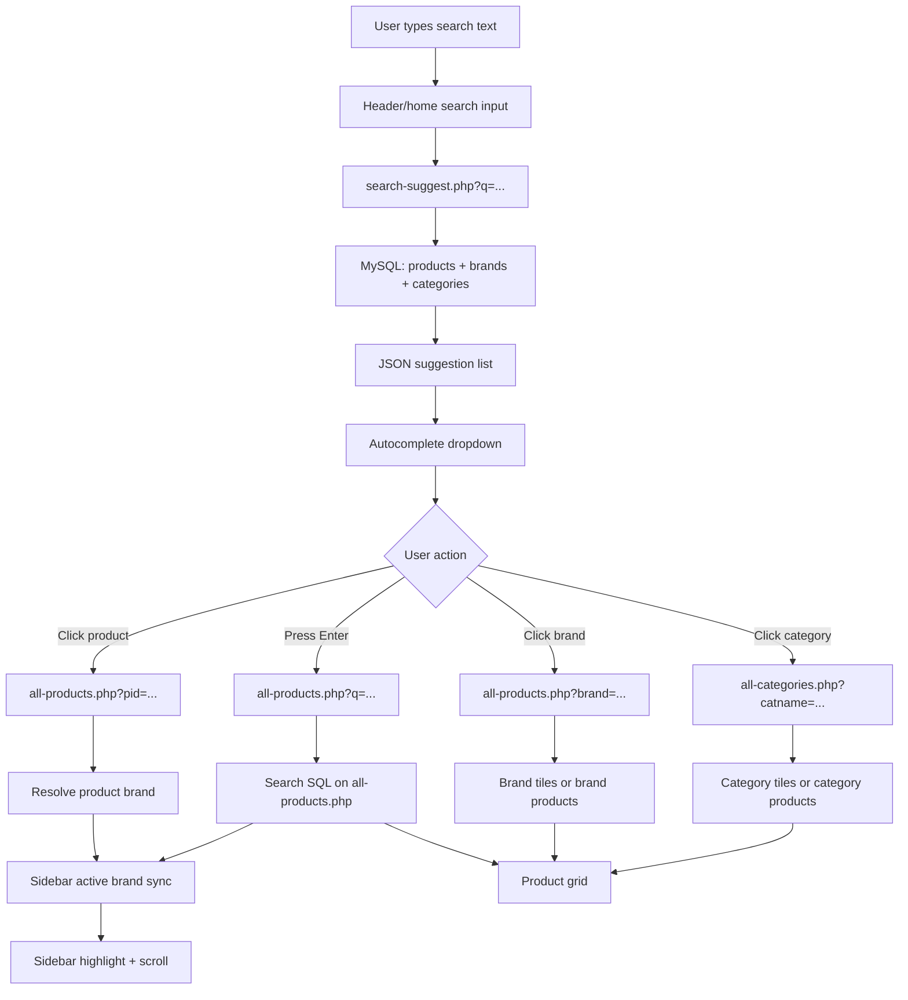
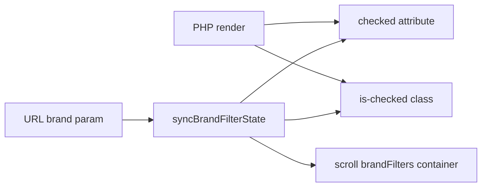

# PVC Project Audit - Phase 2: Search & Filter System

## Executive Summary

The product discovery system is functional, but it is not yet cohesive. Search, brand filtering, category browsing, and URL routing all exist, but they are implemented through a mix of server-side PHP, inline JavaScript, and partially duplicated search code paths. The result is a system that usually works for direct clicks, but is inconsistent across deep links, refresh, browser history, and alternate entry points.

The most important findings are:

- `all-products.php` now supports brand, category, product detail, and keyword search routing, but the logic is still layered and conditional rather than unified.
- The search endpoint in `search-suggest.php` is simple `LIKE` matching with limited ranking and no normalization beyond lowercase comparison.
- The sidebar filter experience is rendered server-side, but active state and scroll positioning must be synchronized carefully to stay visible and stable.
- Search and filter state are not represented by a single canonical model. Multiple parameters can describe similar intent, but precedence and fallback behavior are not fully standardized.
- There is duplicated and partially overlapping search code in `header.php`, `index.php`, and `assets/js/global_header.js`, increasing the risk of drift.

Overall readiness: moderate for a small catalog, not production-robust for a large or fast-changing catalog.

## Current Architecture

### Core Files

- [index.php](../index.php)
- [header.php](../header.php)
- [all-products.php](../all-products.php)
- [all-categories.php](../all-categories.php)
- [search-suggest.php](../search-suggest.php)
- [assets/js/global_header.js](../assets/js/global_header.js)
- [assets/js/main.js](../assets/js/main.js)
- [assets/js/cart.js](../assets/js/cart.js)
- [assets/js/global_footer.js](../assets/js/global_footer.js)
- [assets/css/all-products.css](../assets/css/all-products.css)
- [assets/css/global_header.css](../assets/css/global_header.css)

### Request Flow Diagram

### Search Flow

#### Home Page Search

The home page search form is in [index.php](../index.php) and submits `q` directly to `all-products.php`.

#### Header Search Suggestions

The live suggestion endpoint is [search-suggest.php](../search-suggest.php). It returns products, brands, and categories as JSON. The live dropdown behavior is driven by [header.php](../header.php) for the current site shell, with a second, partially overlapping implementation in [assets/js/global_header.js](../assets/js/global_header.js).

#### Product Listing

[all-products.php](../all-products.php) is the canonical listing page. It now accepts:

- `brand`
- `cat`
- `pid`
- `q`

The page resolves which display mode to use and renders either category tiles or product cards.

### Filter Flow

The sidebar filter for brands is rendered in [all-products.php](../all-products.php) and styled by [assets/css/all-products.css](../assets/css/all-products.css). Active state is represented by both `input:checked` and `.is-checked`.

### Navigation Flow

Navigation is split between:

- top-level PHP includes and markup in [header.php](../header.php)
- dynamically generated search suggestions in [search-suggest.php](../search-suggest.php)
- route handling in [all-products.php](../all-products.php) and [all-categories.php](../all-categories.php)

That means the same user intent can be represented by different URLs depending on entry point:

- brand browse: `all-products.php?brand=B01`
- category browse: `all-products.php?brand=B01&cat=C01`
- product detail-ish entry: `all-products.php?pid=P01`
- keyword search: `all-products.php?q=cable`

## URL Behaviour

### Supported URLs

- `all-products.php`
- `all-products.php?brand=B01`
- `all-products.php?brand=B01&cat=C01`
- `all-products.php?pid=P01`
- `all-products.php?q=cable`
- `all-categories.php`
- `all-categories.php?brand=B01`
- `all-categories.php?catname=Accessories`

### Parameter Precedence

Observed precedence in [all-products.php](../all-products.php):

1. `pid` if provided
2. `q` if provided
3. `brand` + `cat`
4. `brand`
5. default tiles

This is mostly sensible, but the precedence is implicit in branching rather than declared as a policy. That makes maintenance harder and introduces edge-case ambiguity.

### Invalid / Missing Parameter Handling

- Invalid `brand` falls back to the default tiles view.
- Invalid `cat` under a valid brand falls back to brand tiles or products depending on branch.
- Invalid `pid` results in an empty product view with no explicit error state.
- Invalid `q` returns no products, but the empty state messaging must be maintained carefully.

## SQL Analysis

### search-suggest.php

Current query coverage:

- product name
- product brand name
- product category name
- brand name suggestions
- category name suggestions

Strengths:

- Uses `LOWER()` to avoid case sensitivity problems.
- Returns focused suggestion sets with limits.

Weaknesses:

- Uses basic substring matching only.
- No SKU / model normalization layer.
- No stemming, synonyms, tokenization, or relevance scoring beyond prefix preference.
- No full-text search or indexed search strategy.

### all-products.php

Current query coverage for search mode:

- product name
- product description
- product id / model text
- brand name
- category name

Strengths:

- Search is now applied on the listing page instead of being ignored.
- Search can derive a single brand context when results are brand-unique.

Weaknesses:

- Search is still built as `LIKE` conditions.
- The query shape is complex and branch-heavy.
- The same search logic is written in more than one place instead of being encapsulated.

### Missing Index Considerations

Likely high-value indexes for future optimization:

- `products(brandid, status, display_status)`
- `products(pcat, status, display_status)`
- `products(pname)` or a full-text index if moving to full-text search
- `brands(brandname, status, display_status)`
- `category(cname, status, display_status)`

## Performance Analysis

Observed performance risks:

- Search suggestions query three tables every time and does not cache.
- `all-products.php` performs multiple query branches and may issue an additional lookup to resolve brand context.
- `LIKE '%term%'` does not scale well.
- The page loads many global assets even when only one listing path is needed.

Performance conclusions:

- Acceptable for the current catalog size.
- Not scalable without query consolidation and indexing.

## UX Analysis

### Issues Observed

- Active brand state can be visually inconsistent unless both `checked` and `.is-checked` are synchronized.
- Sidebar scroll position can reset, hiding the active selection.
- Search results and filter states can drift if the page is entered through different routes.
- Empty-state messaging differs depending on which branch produced the listing.
- Some quick links in the site still point to route assumptions rather than canonical discovery URLs.

### Search + Filter UX

Best behavior now requires:

- search query preserved in URL
- sidebar highlight synchronized to resolved brand
- sidebar scroll positioned on the active brand
- no page scroll jump

That is a good baseline, but it is still more fragile than a single source-of-truth state model.

## Accessibility Analysis

Strengths:

- Search and filters are implemented with native form controls.
- Links remain real anchors rather than custom div buttons.

Gaps:

- Some interactive controls rely on custom JS click behavior without explicit keyboard affordances beyond the browser default.
- Autocomplete selection should be audit-checked for arrow key focus management and visible focus state.
- Color-only active states need sufficient contrast and secondary cues.

## Security Review

Strengths:

- Query variables are escaped before use in SQL.
- Search endpoint returns JSON with proper content type and cache controls.

Risks:

- Direct string SQL construction is still used broadly.
- The search endpoint and listing page both rely on manual escaping rather than prepared statements.
- Public search parameters are not heavily constrained, so query-length and abuse hardening would be useful.

## Code Quality Review

### Duplicated Logic

- Search flows appear in `index.php`, `header.php`, and `assets/js/global_header.js`.
- Brand/category browse logic is split across `all-products.php` and `all-categories.php`.
- Active-state synchronization logic is implemented in-page rather than in a shared helper.

### Large Files

- `all-products.php` and `all-categories.php` are both large and heavily conditional.
- `header.php` mixes CSS, markup, and search JavaScript.

### Separation of Concerns

- Presentation, routing, search logic, and state synchronization are not clearly separated.
- The current structure works, but it is difficult to reason about and easy to regress.

## Critical Bugs

### Critical 1: Search URL contract drift

Description:
- Multiple search implementations exist, and not all of them use the same query key.

Root cause:
- Duplicate search UI logic and inconsistent route assumptions.

Affected files:
- [index.php](../index.php)
- [header.php](../header.php)
- [assets/js/global_header.js](../assets/js/global_header.js)
- [all-products.php](../all-products.php)

### Critical 2: Search results can be ignored by listing page if routing is not aligned

Description:
- `all-products.php` must explicitly support `q` or search pages fall back to default tiles.

Root cause:
- Listing controller originally only considered brand/category/product ID branches.

Affected files:
- [all-products.php](../all-products.php)

### Critical 3: Active filter state can drift from the rendered listing

Description:
- Visual state, checked state, and sidebar scroll must all be synchronized.

Root cause:
- State is split between server render and client-side post-processing.

Affected files:
- [all-products.php](../all-products.php)
- [assets/css/all-products.css](../assets/css/all-products.css)

## High Priority Bugs

### High 1: Simple LIKE search has poor recall and ranking

Description:
- Search matches are basic substring lookups and do not normalize synonyms or abbreviations.

Affected files:
- [search-suggest.php](../search-suggest.php)
- [all-products.php](../all-products.php)

### High 2: Duplicate search code paths create drift risk

Description:
- There is a live search block in [header.php](../header.php) and a separate global search component in [assets/js/global_header.js](../assets/js/global_header.js).

Affected files:
- [header.php](../header.php)
- [assets/js/global_header.js](../assets/js/global_header.js)

### High 3: Invalid deep links do not have robust user feedback

Description:
- Invalid brand/category/product IDs are not always presented with a clear fallback message.

Affected files:
- [all-products.php](../all-products.php)
- [all-categories.php](../all-categories.php)

## Medium Priority Bugs

### Medium 1: Sidebar scroll restoration is manual

Description:
- The active brand must be scrolled into view explicitly after render.

Affected files:
- [all-products.php](../all-products.php)

### Medium 2: Search and filter state are not fully canonicalized

Description:
- A keyword search plus brand/category filters can represent overlapping intent, but there is no shared state object.

Affected files:
- [all-products.php](../all-products.php)
- [all-categories.php](../all-categories.php)

### Medium 3: Category and brand routing is inconsistent across pages

Description:
- Some entry points use `catname`, some use `cat`, some use `category`.

Affected files:
- [index.php](../index.php)
- [header.php](../header.php)
- [all-products.php](../all-products.php)
- [all-categories.php](../all-categories.php)

## Low Priority Bugs

### Low 1: Empty-state copy varies by branch

Description:
- Users may see different wording depending on which path produced the result set.

Affected files:
- [all-products.php](../all-products.php)
- [all-categories.php](../all-categories.php)

### Low 2: Search result thumbnails fall back to a generic image

Description:
- The fallback is acceptable, but it reduces result specificity.

Affected files:
- [search-suggest.php](../search-suggest.php)
- [header.php](../header.php)

## Missing Features

- Full-text or relevance-ranked search.
- Tokenization and synonym handling for common catalog terms.
- Explicit browser-history state restoration for combined search/filter sessions.
- Unified URL contract for all discovery surfaces.
- Accessible keyboard focus model for autocomplete beyond basic arrow key movement.
- Server-side persistence of UI state across page refreshes beyond query parameters.

## Functional Testing Matrix

Legend:

- PASS = implemented and consistent in code path
- FAIL = broken or missing
- PARTIAL = works in some flows but not all
- NOT IMPLEMENTED = no clear support found

| Scenario | Status | Notes |
|---|---|---|
| Search product from home page | PASS | Home form submits `q` to `all-products.php` |
| Search brand from autocomplete | PASS | Brand suggestions route to `all-products.php?brand=...` |
| Search category from autocomplete | PASS | Category suggestions route to `all-categories.php?catname=...` |
| Search by partial keyword | PARTIAL | Basic `LIKE` matching works but recall is limited |
| Search by multiple keywords | PARTIAL | No tokenization or scoring |
| Empty search | PASS | Suggestion panel can close / no-op |
| Invalid search | PASS | Listing page shows empty state when query yields no rows |
| Click product suggestion | PASS | Routes to `all-products.php?pid=...` |
| Click category suggestion | PASS | Routes to category page |
| Click brand suggestion | PASS | Routes to brand view |
| Press Enter in search | PASS | Uses the form submission path |
| Refresh product detail/search page | PARTIAL | Query parameter survives; UI state depends on route branch |
| Browser Back | PARTIAL | History should work, but state cohesion depends on parameters |
| Browser Forward | PARTIAL | Same limitation as back navigation |
| Mobile search interaction | PARTIAL | Search UI exists, but responsive interactions need audit on device widths |
| Desktop search interaction | PASS | Primary flow works |
| Brand filter checkbox state | PASS | Server render + client sync keep it checked |
| Brand filter sidebar scroll | PASS | Active brand is scrolled into view |
| Category filter state | PASS | Category page mirrors the same pattern |
| Stock filter | NOT IMPLEMENTED | No actual filtering logic found; only UI element exists |
| Sorting | PASS | Client-side sort reorders rendered cards |
| Clear filters | PASS | Resets the relevant route |
| Combined search + brand filter | PARTIAL | Search can imply brand context, but multi-brand search remains broad |
| Deep link to invalid brand | PARTIAL | Falls back, but feedback is not explicit |
| Deep link to invalid category | PARTIAL | Fallback behavior exists but is not strongly signposted |
| No image result | PASS | Fallback images/placeholders exist |
| Keyboard navigation in autocomplete | PARTIAL | Arrow/Enter/Escape exists in at least one implementation |
| Duplicate results suppression | PARTIAL | Some dedupe exists for categories; search endpoint still returns mixed sources |

## Search and Filter Integration Findings

### What Works

- Search results can route to product, brand, and category views.
- `all-products.php` now respects `q` and can render a results-only product listing.
- Brand sidebar state can be synchronized to the active brand and scrolled into view.
- Category browsing and brand browsing remain functional.

### What Still Needs Hardening

- Search and filters are not governed by a single state model.
- There are two conceptual search implementations: the live endpoint plus page-level listing search, and an alternate JS search component that can drift.
- If a search matches multiple brands, the UI cannot always reflect a single active brand without making an arbitrary choice.

## Security Review

- Input escaping is present, but prepared statements would be preferable.
- Search parameters are user-controlled and should be bounded and sanitized consistently.
- No obvious XSS vector was found in the rendered discovery flow during this audit, but several places rely on manual escaping and string concatenation.

## Recommended Architecture

1. Make `all-products.php` the single canonical search/listing controller for products.
2. Make `search-suggest.php` a thin suggestion service with a shared normalization layer.
3. Move state interpretation into one reusable resolver function or class.
4. Standardize on `q` for keyword search, `brand` for brand filter, `cat` for category filter, and `pid` for product detail.
5. Consolidate the live header search UI so there is only one active implementation.

## Implementation Roadmap

### Phase 1 - Critical Fixes

- Finalize a single URL contract for search and filter routes.
- Eliminate route mismatches between search components and listing pages.
- Add explicit invalid-parameter fallback messaging.

### Phase 2 - Functional Improvements

- Normalize search keywords and synonyms.
- Improve product ranking and partial-match quality.
- Add explicit filter/search state restoration for refresh and history.

### Phase 3 - UX Improvements

- Improve empty-state messaging.
- Make autocomplete keyboard navigation clearer and more accessible.
- Preserve and surface active filter context more consistently.

### Phase 4 - Refactoring

- Extract shared discovery state resolution into reusable PHP helpers.
- Remove duplicated search code paths.
- Split large page controllers into smaller view and data layers.

### Phase 5 - Performance Optimization

- Add indexes for search and listing queries.
- Reduce repeated SQL hits in the listing pages.
- Consider full-text or indexed search for catalog-scale growth.

### Phase 6 - Future Features

- Synonym-aware search.
- Full-text search scoring.
- Search analytics and zero-result tracking.
- Better mobile filter ergonomics.

## Technical Debt

- Duplicate search logic.
- Large controller-style PHP pages.
- Inline JavaScript for discovery state.
- Mixed URL parameter vocabulary.
- Basic SQL search strategy.
- No shared discovery state abstraction.

## Refactoring Opportunities

- Create a discovery controller helper for `brand`, `cat`, `pid`, and `q` resolution.
- Move repeated search/filter UI state helpers to a shared JS module.
- Centralize search suggestion rendering and keyboard interaction.
- Normalize catalog route generation in one place.

## Performance Improvements

- Add database indexes for the most frequent search and listing predicates.
- Replace broad `LIKE` scans with a more selective search strategy.
- Cache suggestion lookups where safe.
- Reduce duplicate catalog queries by reusing resolved rows.

## Conclusions

The discovery system is usable, but it is still a patchwork of route handlers and UI states rather than a unified search platform. The immediate production risk is not total failure; it is inconsistency. Users can usually find products, but the experience is too fragile across entry points, refreshes, and alternate routes.

The next engineering step should be to unify search and filter state, not to add more ad hoc fixes.